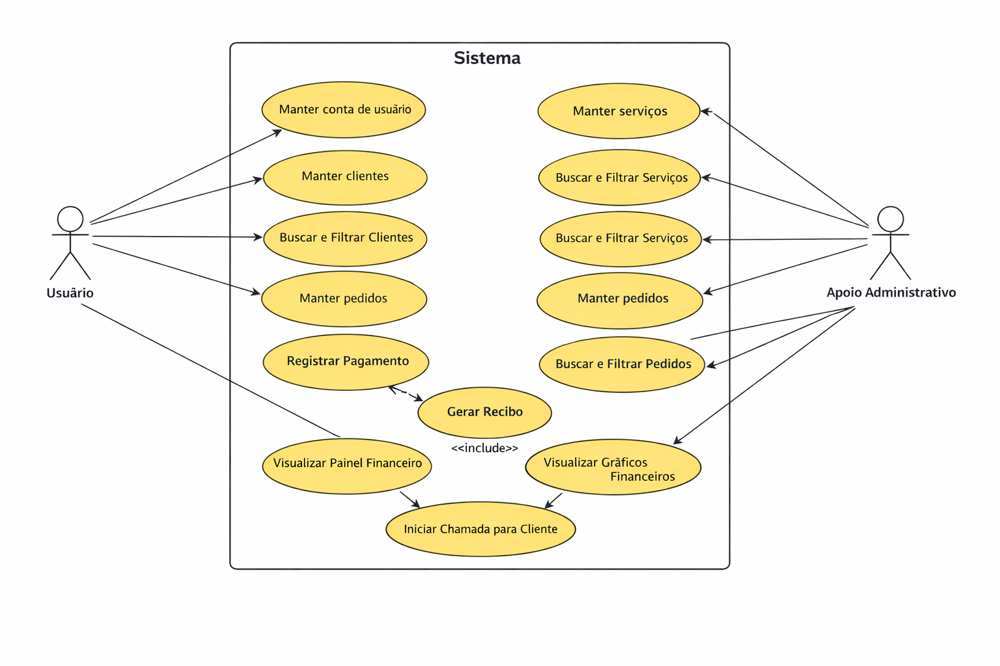

# Especificações do Projeto

Pré-requisitos: <a href="1-Documentação de Contexto.md"> Documentação de Contexto</a>

Definição do problema e ideia de solução a partir da perspectiva do usuário. É composta pela definição do diagrama de personas, histórias de usuários, requisitos funcionais e não funcionais além das restrições do projeto.

Apresente uma visão geral do que será abordado nesta parte do documento, enumerando as técnicas e/ou ferramentas utilizadas para realizar a especificações do projeto

## Personas

## Histórias de Usuários

Com base na análise das personas forma identificadas as seguintes histórias de usuários:

| EU COMO... `PERSONA`               | QUERO/PRECISO ... `FUNCIONALIDADE`                                     | PARA ... `MOTIVO/VALOR`                                                  |
| ---------------------------------- | ---------------------------------------------------------------------- | ------------------------------------------------------------------------ |
| **João Pereira Santos**   | Registrar os serviços combinados de forma rápida                       | Não perder o controle do que foi acordado com o cliente.                 |
| **João Pereira Santos**   | Anotar os valores pendentes de recebimento                             | Saber exatamente quem está me devendo e poder cobrar.                    |
| **João Pereira Santos**   | Gerar e enviar propostas de serviço de forma digital                   | Agilizar o fechamento de negócios sem complicação.                       |
| **Carla Mendes Oliveira**    | Criar propostas padronizadas com a minha marca (identidade visual)     | Transmitir uma imagem mais profissional aos meus clientes.               |
| **Carla Mendes Oliveira**    | Registrar os pagamentos recebidos vinculados às propostas              | Centralizar as informações comerciais e financeiras no mesmo lugar.      |
| **Carla Mendes Oliveira**    | Registrar as minhas despesas recorrentes e custos operacionais         | Ter controle de quanto meu negócio custa para operar mensalmente.        |
| **Carla Mendes Oliveira**    | Visualizar um painel (dashboard) com resumos e gráficos de faturamento | Entender a real situação financeira do meu negócio para previsibilidade. |
| **Marcos Ribeiro Costa** | De um acesso compartilhado simplificado ao sistema   | Que minha esposa/assistente possa me ajudar com registros e cobranças.   |
| **Marcos Ribeiro Costa** | Visualizar rapidamente o fluxo de caixa do dia/semana                  | Tomar melhores decisões sobre despesas urgentes e compras de material.   |
| **Marcos Ribeiro Costa** | Emitir ordens de serviço claras com status de andamento                | Que minha auxiliar possa acompanhar a execução dos trabalhos.            |

## Requisitos

As tabelas que se seguem apresentam os requisitos funcionais e não funcionais que detalham o escopo do projeto. Para determinar a prioridade de requisitos, aplicar uma técnica de priorização de requisitos e detalhar como a técnica foi aplicada.

### Requisitos Funcionais

| ID     | Descrição do Requisito                  | Prioridade | Responsável |
| ------ | --------------------------------------- | ---------- | ----------- |
| RF-001 | O sistema deve permitir que o usuário crie uma conta informando nome, CPF/CNPJ, telefone, email, endereço e senha | ALTA       | Amanda       |
| RF-002 | O sistema deve permitir que o usuário edite os dados de sua conta  | ALTA      | Amanda        |
| RF-003 | O sistema deve permitir que o usuário exclua a sua conta, removendo os dados vinculados após confirmação | ALTA       | Amanda       |
| RF-004 | O sistema deve permitir que o usuário cadastre clientes com nome, CPF/CNPJ, telefone, email e endereço   | ALTA      | Bruna        |
| RF-005 | O sistema deve permitir que o usuário edite os dados de um cliente | ALTA       | Bruna       |
| RF-006 | O sistema deve permitir que o usuário exclua um cliente, desde que não haja documentos ativos vinculados   | ALTA      | Bruna        |
| RF-007 | O sistema deve permitir que o usuário busque e filtre clientes cadastrados por nome, CPF/CNPJ, telefone, email e endereço | MÉDIA       | Bruna       |
| RF-008 | O sistema deve permitir que o usuário crie pedidos com um ou mais serviços/produtos vinculado a um cliente, definindo quantidade, valor unitário e desconto  | ALTA      | Eric        |
| RF-009 | O sistema deve permitir que o usuário edite os dados de um pedido | ALTA       | Eric       |
| RF-010 | O sistema deve permitir que o usuário exclua um pedido | ALTA      | Eric        |
| RF-011 | O sistema deve permitir que o usuário busque e filtre pedidos por cliente e nome de serviço/produto | MÉDIA       | Frederico       |
| RF-012 | o sistema deve permitir que o usuário cadastre serviços/produtos, informando nome, descrição, valor unitário e unidade de medida  | ALTA     | Frederico        |
| RF-013 | O sistema deve permitir que o usuário edite os dados de um serviço/produto | ALTA       | Frederico      |
| RF-014 | o sistema deve permitir que o usuário exclua um serviço/produto, desde que não esteja vinculado a um pedido ativo   | ALTA      | Guilherme        |
| RF-015 | O sistema deve permitir que o usuário busque e filtre serviços/produtos por nome, descrição e valor  | MÉDIA       | Guilherme       |
| RF-016 | O sistema deve exibir um painel com a receita recebida, receita a receber e receita em atraso   | MÉDIA      | Guilherme        |
| RF-017 | O sistema deve apresentar um gráfico de resultado com os valores calculados a partir da diferença entre receitas e custos | BAIXA       | Maria Julia       |
| RF-018 | O sistema deve exibir um painel com os custos pagos, os custos previstos e os custos em atraso  | MÉDIA      | Maria Julia        |
| RF-019 | O sistema deve permitir gerar um recibo a partir de um pagamento registrado de um pedido, contendo os dados do usuário, dados do cliente, descrição dos serviços prestados, valor pago, data e forma de pagamento | MÉDIA | Amanda        |
| RF-020 | O sistema deve permitir gerar um orçamento a partir de um pedido criado, contendo os dados do usuário, dados do cliente, descrição dos serviços, valor estimado, data prevista para execução e método de pagamento | MÉDIA  | Eric       |
| RF-021 | O sistema deve permitir gerar uma ordem de serviço a partir de um pedido confirmado, contendo os dados do usuário, dados do cliente, descrição dos serviços, status do serviço, data de execução e responsável pela execução | MÉDIA  | Eric       |
| RF-022 | O sistema deve permitir que o usuário inicie uma chamada telefônica para um cliente diretamente através do aplicativo mobile  | ALTA      | Frederico       |
| RF-023 | O sistema deve permitir que o usuário envie mensagens de texto (SMS ou WhatsApp) para um cliente diretamente através do aplicativo mobile| ALTA      | Frederico       |

### Requisitos não Funcionais

| ID      | Descrição do Requisito                                            | Prioridade |
| ------- | ----------------------------------------------------------------- | ---------- |
| RNF-001 | As senhas dos usuários devem ser criptografadas utilizando algoritmo de hash seguro (bcrypt) antes de serem armazenadas no banco de dados, garantindo que nenhuma senha seja salva em texto puro | ALTA      |
| RNF-002 | Toda comunicação entre o aplicativo e o servidor deve ser realizada por meio de HTTPS, com autenticação das requisições via token JWT, garantindo que apenas usuários autenticados acessem os dados da aplicação            | ALTA      |
| RNF-003 | A interface deve ser simples e intuitiva, permitindo que o usuário realize as principais tarefas da aplicação sem necessidade de treinamento prévio ou conhecimento técnico avançado | ALTA      |
| RNF-004 | O aplicativo mobile deve funcionar corretamente nos sistemas operacionais Android e iOS, mantendo comportamento e aparência consistentes entre as duas plataformas          | MÉDIA     |
| RNF-005 | A versão web da aplicação deve funcionar corretamente nos principais navegadores modernos, incluindo Google Chrome, Mozilla Firefox, Safari e Microsoft Edge, em suas versões mais recentes | MÉDIA      |
| RNF-006 | As telas e operações principais da aplicação devem apresentar tempo de resposta inferior a 3 segundos em condições normais de uso e conectividade | ALTA      |

## Restrições

O projeto está restrito pelos itens apresentados na tabela a seguir.

| ID  | Restrição                                             |
| --- | ----------------------------------------------------- |
| 01  | O projeto deverá ser entregue até o final do semestre |
| 02  | O backend deverá ser desenvolvido exclusivamente em Node.js, não sendo permitida a adoção de outras linguagens ou runtimes server-side no escopo do projeto.|
| 03  | O frontend web deverá ser desenvolvido em React, e o aplicativo móvel em React Native, mantendo consistência tecnológica entre as plataformas.|
| 04  | A aplicação não poderá emitir documentos fiscais oficiais (como NF-e ou NFS-e), ficando restrita à geração de documentos comerciais informais, como propostas, ordens de serviço e recibos.|
| 05  | O sistema não integrará com sistemas bancários ou gateways de pagamento, limitando-se ao registro manual de recebimentos e despesas pelo próprio usuário.|
| 06  | A solução deverá ser desenvolvida com tecnologias acessíveis à equipe do projeto, sem dependência de licenças pagas de frameworks, plataformas ou ferramentas proprietárias.|
| 07  | O escopo da aplicação se restringe ao controle comercial e financeiro básico, não contemplando funcionalidades de CRM avançado, gestão de estoque ou módulos contábeis completos.|
| 08  | A aplicação não realizará envio automático de documentos por e-mail ou WhatsApp de forma nativa — o compartilhamento dependerá de recursos do próprio dispositivo do usuário ou de integrações futuras fora do escopo atual.|

## Diagrama de Casos de Uso

O diagrama de casos de uso representa de forma visual, as principais funcionalidades oferecidas pelo sistema e como elas se relacionam com os atores que interagem com a aplicação. A modelagem foi construída com base nas personas, histórias de usuário e requisitos funcionais definidos anteriormente.

No contexto deste projeto, o ator principal é o **Usuário**, que representa o profissional autônomo, microempreendedor individual (MEI) ou pequeno prestador de serviço que utiliza o sistema para organizar sua rotina comercial e financeira.

Também foi considerado o ator **Apoio administrativo**, que representa uma pessoa auxiliar, como assistente, sócio ou familiar, que pode colaborar em atividades operacionais, como cadastro de informações, acompanhamento de pedidos, organização de registros e apoio na gestão financeira básica.

O diagrama contempla as funcionalidades essenciais do sistema, incluindo o gerenciamento da conta do usuário, cadastro de clientes e serviços, controle de pedidos, emissão de documentos comerciais, registro de pagamentos e visualização de informações financeiras do negócio.

### Atores Identificados

| Ator | Descrição |
|-----|-----|
| Usuário | Profissional autônomo, MEI ou pequeno prestador de serviço que utiliza o sistema para organizar clientes, serviços, pedidos, recebimentos e informações financeiras do negócio. |
| Apoio administrativo | Pessoa que auxilia o usuário principal nas rotinas administrativas, como cadastro de informações, acompanhamento de pedidos e organização financeira básica. |

---

### Casos de Uso Identificados

| Caso de Uso | Descrição |
|-----|-----|
| Manter conta de usuário | Permite criar, editar e excluir a conta do usuário no sistema. |
| Manter clientes | Permite cadastrar, editar e excluir clientes. |
| Buscar e filtrar clientes | Permite localizar clientes cadastrados utilizando critérios como nome ou CPF/CNPJ. |
| Manter serviços | Permite cadastrar, editar e excluir serviços oferecidos pelo usuário. |
| Buscar e filtrar serviços | Permite localizar serviços cadastrados no sistema. |
| Manter pedidos | Permite criar, editar e excluir pedidos vinculados a clientes e serviços. |
| Buscar e filtrar pedidos | Permite localizar pedidos por cliente ou serviço. |
| Registrar pagamento | Permite registrar pagamentos recebidos referentes aos pedidos realizados. |
| Gerar recibo | Permite emitir um recibo a partir de um pagamento registrado. |
| Gerar contrato de serviço | Permite gerar um contrato de prestação de serviço vinculado a um cliente e a um pedido. |
| Visualizar painel financeiro | Permite visualizar um resumo financeiro contendo valores recebidos, a receber e em atraso. |
| Visualizar gráficos financeiros | Permite visualizar gráficos comparativos de receitas e custos do negócio. |
| Iniciar chamada para cliente | Permite realizar chamada telefônica diretamente para um cliente pelo aplicativo mobile. |

---

### Relacionamentos entre Casos de Uso

Alguns casos de uso possuem dependência lógica entre si. O caso de uso **Gerar recibo**, por exemplo, depende da existência de um pagamento previamente registrado no sistema. Dessa forma, o recibo é gerado a partir das informações do pagamento vinculado a um pedido.

Os casos de uso de **busca e filtragem** estão associados às funcionalidades de consulta dos módulos de clientes, serviços e pedidos, permitindo que o usuário encontre informações de forma rápida e organizada dentro do sistema.

---

### Diagrama de Casos de Uso

A figura a seguir apresenta o diagrama de casos de uso da aplicação, evidenciando os atores e as principais funcionalidades do sistema.

> O diagrama ilustra as interações entre os atores **Usuário** e **Apoio administrativo** com as funcionalidades principais do sistema de organização comercial e financeira.

# Gerenciamento de Tempo

O gerenciamento de tempo tem como objetivo planejar, organizar e controlar as atividades necessárias para o desenvolvimento do projeto dentro do prazo estabelecido.

Para facilitar esse controle, o projeto foi dividido em cinco etapas principais, cada uma contemplando atividades específicas relacionadas ao planejamento, modelagem, desenvolvimento e finalização do sistema.

Essa divisão permite acompanhar o progresso do projeto, identificar possíveis atrasos e garantir que o desenvolvimento avance de forma organizado.

## Cronograma do Projeto

| Etapa | Período |
|------|------|
| Etapa 1 | 09/02/2026 a 08/03/2026 |
| Etapa 2 | 10/03/2026 a 12/04/2026 |
| Etapa 3 | 13/04/2026 a 10/05/2026 |
| Etapa 4 | 11/05/2026 a 31/05/2026 |
| Etapa 5 | 01/06/2026 a 21/06/2026 |

## Planejamento das Atividades

| Etapa | Atividade | Início | Fim |
|------|------|------|------|
| Etapa 1 | Levantamento de requisitos | 09/02/2026 | 16/02/2026 |
| Etapa 1 | Definição do escopo do sistema | 17/02/2026 | 22/02/2026 |
| Etapa 1 | Planejamento do projeto | 23/02/2026 | 02/03/2026 |
| Etapa 1 | Elaboração da documentação inicial | 03/03/2026 | 08/03/2026 |
| Etapa 2 | Modelagem do sistema | 10/03/2026 | 20/03/2026 |
| Etapa 2 | Modelagem do banco de dados | 21/03/2026 | 30/03/2026 |
| Etapa 2 | Protótipo das interfaces | 31/03/2026 | 12/04/2026 |
| Etapa 3 | Estruturação do backend (API) | 13/04/2026 | 25/04/2026 |
| Etapa 3 | Implementação das regras de negócio | 26/04/2026 | 10/05/2026 |
| Etapa 4 | Desenvolvimento do frontend web | 11/05/2026 | 22/05/2026 |
| Etapa 4 | Desenvolvimento do aplicativo mobile | 23/05/2026 | 31/05/2026 |
| Etapa 5 | Integração dos sistemas | 01/06/2026 | 10/06/2026 |
| Etapa 5 | Testes do sistema | 11/06/2026 | 16/06/2026 |
| Etapa 5 | Ajustes finais e documentação | 17/06/2026 | 21/06/2026 |

## Gráfico de Gantt Simplificado

| Etapa | Fev | Mar | Abr | Mai | Jun |
|------|------|------|------|------|------|
| Planejamento | █████ |  |  |  |  |
| Modelagem |  | █████ |  |  |  |
| Backend |  |  | █████ |  |  |
| Frontend / Mobile |  |  |  | █████ |  |
| Integração e Testes |  |  |  |  | █████ |

---

# Gerenciamento de Equipe

O projeto será desenvolvido por uma equipe composta por seis integrantes. Todos os membros participarão das atividades de planejamento, desenvolvimento e validação do sistema.

Considerando que os integrantes possuem níveis de experiência entre júnior e pleno, as atividades serão distribuídas de forma equilibrada para incentivar a colaboração e o aprendizado coletivo.

A equipe será responsável pelo desenvolvimento das diferentes camadas da aplicação distribuída, incluindo:

- Interface web
- API backend
- Aplicação mobile
- Banco de dados
- Integração entre os componentes

## Estrutura da Equipe

| Área | Responsabilidades |
|------|------|
| Backend | Desenvolvimento da API e regras de negócio |
| Frontend Web | Desenvolvimento da interface web utilizando React |
| Mobile | Desenvolvimento do aplicativo utilizando React Native |
| Banco de Dados | Modelagem e gerenciamento do PostgreSQL |
| Integração | Comunicação entre os componentes do sistema |
| Testes | Validação das funcionalidades e qualidade do sistema |

---

# Ferramentas de Gerenciamento do Projeto

| Ferramenta | Finalidade |
|------|------|
| GitHub | Controle de versão do código |
| Git | Versionamento do código |
| Figma | Prototipação das interfaces |
| Linear | Organização das tarefas |
| Visual Studio Code | Desenvolvimento do código |
| PostgreSQL | Gerenciamento do banco de dados |

---

# Considerações Finais

A adoção de práticas de gerenciamento de projeto contribui para estruturar o desenvolvimento do sistema de forma organizada, permitindo que as atividades sejam distribuídas entre os integrantes da equipe e executadas dentro do prazo estabelecido.

Além disso, a utilização de uma arquitetura distribuída possibilita maior modularidade no desenvolvimento do sistema, permitindo que diferentes componentes sejam desenvolvidos e integrados de forma eficiente.
