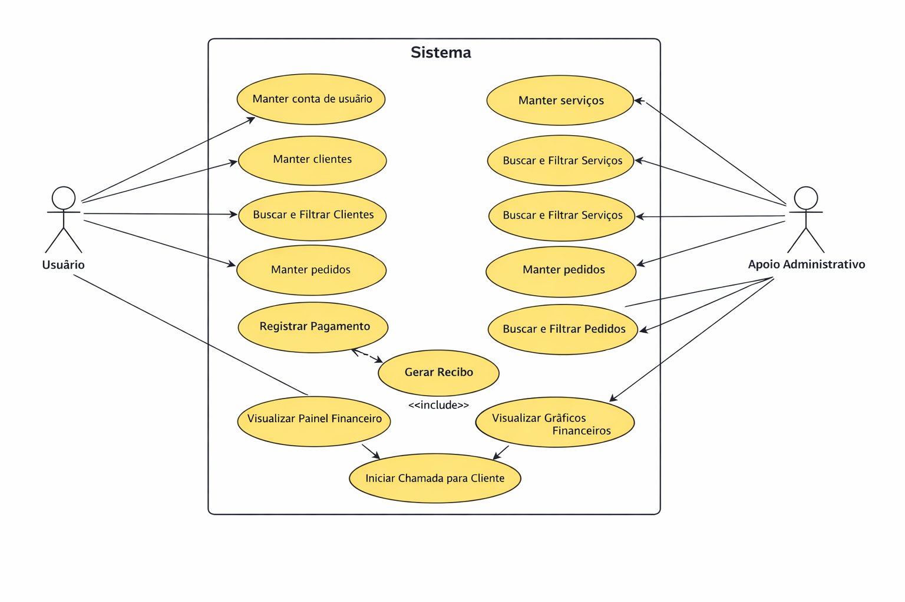

# Especificações do Projeto

Pré-requisitos: <a href="01-Documentação de Contexto.md"> Documentação de Contexto</a>

Este documento consolida a especificação funcional do sistema entregue, a partir da perspectiva do usuário. O conteúdo reúne personas, histórias de usuário, requisitos funcionais, requisitos não funcionais, restrições, casos de uso e organização temporal do projeto, sempre alinhados ao estado atual da implementação.

## Personas

## Histórias de Usuários

Com base nas personas analisadas, foram consolidadas as seguintes histórias de usuário para o sistema efetivamente entregue:

| EU COMO... `PERSONA`      | QUERO/PRECISO ... `FUNCIONALIDADE`                             | PARA ... `MOTIVO/VALOR`                                                  |
| ------------------------- | -------------------------------------------------------------- | ------------------------------------------------------------------------ |
| **João Pereira Santos**   | Registrar clientes e pedidos com rapidez                       | Não perder o controle do que foi acordado com cada atendimento.          |
| **João Pereira Santos**   | Emitir orçamento e ordem de serviço em PDF                     | Formalizar propostas e serviços com mais profissionalismo.               |
| **João Pereira Santos**   | Registrar receitas e custos do negócio                         | Acompanhar valores pagos, pendentes e em atraso.                         |
| **Carla Mendes Oliveira** | Manter um catálogo padronizado de produtos e serviços          | Ganhar agilidade ao montar pedidos e propostas.                          |
| **Carla Mendes Oliveira** | Visualizar um painel financeiro resumido                       | Entender a situação atual do negócio sem depender de planilhas externas. |
| **Carla Mendes Oliveira** | Emitir recibos de pagamentos confirmados                       | Formalizar recebimentos para clientes e manter histórico.                |
| **Marcos Ribeiro Costa**  | Operar o sistema tanto no navegador quanto no celular          | Registrar e consultar informações em diferentes contextos de trabalho.   |
| **Marcos Ribeiro Costa**  | Entrar em contato rápido com clientes por telefone ou WhatsApp | Agilizar atendimento e cobrança diretamente a partir do cadastro.        |
| **Marcos Ribeiro Costa**  | Editar pedidos e lançamentos conforme a evolução do serviço    | Manter o sistema coerente com a rotina real do negócio.                  |

## Requisitos

As tabelas a seguir apresentam os requisitos funcionais e não funcionais do sistema implementado.

### Requisitos Funcionais

| ID     | Descrição do Requisito                                                                                                                 | Prioridade | Responsável |
| ------ | -------------------------------------------------------------------------------------------------------------------------------------- | ---------- | ----------- |
| RF-001 | O sistema deve permitir que o usuário crie uma conta com nome, email e senha, gerando sessão autenticada após o cadastro               | ALTA       | Amanda      |
| RF-002 | O sistema deve permitir que o usuário realize login e mantenha sessão autenticada para uso das áreas protegidas                        | ALTA       | Amanda      |
| RF-003 | O sistema deve permitir que o usuário visualize e edite os dados do perfil do negócio em configurações                                 | ALTA       | Amanda      |
| RF-004 | O sistema deve permitir que o usuário cadastre clientes com nome, tipo, documento, telefone, email e endereço                          | ALTA       | Bruna       |
| RF-005 | O sistema deve permitir que o usuário edite os dados de um cliente                                                                     | ALTA       | Bruna       |
| RF-006 | O sistema deve permitir que o usuário exclua um cliente, respeitando as validações de vínculo do sistema                               | ALTA       | Bruna       |
| RF-007 | O sistema deve permitir que o usuário busque e filtre clientes cadastrados                                                             | MÉDIA      | Bruna       |
| RF-008 | O sistema deve permitir que o usuário crie pedidos com um ou mais itens de catálogo, cliente opcional e condições comerciais           | ALTA       | Eric        |
| RF-009 | O sistema deve permitir que o usuário edite pedidos, incluindo status válidos e composição dos itens                                   | ALTA       | Eric        |
| RF-010 | O sistema deve permitir que o usuário exclua pedidos quando não houver impedimento pelas regras do negócio                             | ALTA       | Eric        |
| RF-011 | O sistema deve permitir que o usuário busque e filtre pedidos por texto, cliente e status                                              | MÉDIA      | Frederico   |
| RF-012 | O sistema deve permitir que o usuário cadastre serviços e produtos no catálogo                                                         | ALTA       | Frederico   |
| RF-013 | O sistema deve permitir que o usuário edite os dados de um item do catálogo                                                            | ALTA       | Frederico   |
| RF-014 | O sistema deve permitir que o usuário exclua um item de catálogo, respeitando os vínculos existentes                                   | ALTA       | Guilherme   |
| RF-015 | O sistema deve permitir que o usuário busque e filtre itens do catálogo                                                                | MÉDIA      | Guilherme   |
| RF-016 | O sistema deve permitir que o usuário registre lançamentos financeiros de receita e custo                                              | ALTA       | Guilherme   |
| RF-017 | O sistema deve permitir que o usuário edite lançamentos financeiros e aplique as restrições de exclusão previstas                      | ALTA       | Maria Julia |
| RF-018 | O sistema deve exibir um painel financeiro com resumos de receita confirmada, valores pendentes, atrasos, resultado e listagem recente | MÉDIA      | Maria Julia |
| RF-019 | O sistema deve permitir gerar um recibo em PDF a partir de um lançamento confirmado                                                    | MÉDIA      | Amanda      |
| RF-020 | O sistema deve permitir gerar um orçamento em PDF a partir de um pedido elegível                                                       | MÉDIA      | Eric        |
| RF-021 | O sistema deve permitir gerar uma ordem de serviço em PDF a partir de um pedido elegível                                               | MÉDIA      | Eric        |
| RF-022 | O sistema deve permitir que o usuário inicie uma chamada telefônica para um cliente com telefone válido                                | ALTA       | Frederico   |
| RF-023 | O sistema deve permitir que o usuário abra uma conversa no WhatsApp para um cliente com telefone válido                                | ALTA       | Frederico   |

### Requisitos não Funcionais

| ID      | Descrição do Requisito                                                                                                                                  | Prioridade |
| ------- | ------------------------------------------------------------------------------------------------------------------------------------------------------- | ---------- |
| RNF-001 | As credenciais e sessões dos usuários devem ser tratadas com mecanismos de autenticação seguros, sem armazenamento de senha em texto puro               | ALTA       |
| RNF-002 | A comunicação entre clientes e servidor deve ser compatível com execução autenticada por sessão e cookies, com uso de HTTPS nos ambientes de publicação | ALTA       |
| RNF-003 | A interface deve ser simples, direta e compatível com uso operacional sem treinamento avançado                                                          | ALTA       |
| RNF-004 | A aplicação mobile deve operar em Android e iOS, além de suportar execução web para desenvolvimento e validação básica                                  | MÉDIA      |
| RNF-005 | A aplicação web deve funcionar nos principais navegadores modernos                                                                                      | MÉDIA      |
| RNF-006 | As operações principais devem responder de forma adequada para uso cotidiano, com feedback de loading, erro e sucesso nas ações relevantes              | ALTA       |

## Restrições

O projeto está restrito pelos itens apresentados na tabela a seguir.

| ID  | Restrição                                                                                                                                              |
| --- | ------------------------------------------------------------------------------------------------------------------------------------------------------ |
| 01  | O projeto deve ser entregue dentro do calendário acadêmico da disciplina                                                                               |
| 02  | O backend deve permanecer em Node.js com Fastify e MongoDB, seguindo a arquitetura distribuída adotada no monorepo                                     |
| 03  | O frontend web deve ser desenvolvido em Next.js/React, e o aplicativo móvel em Expo/React Native                                                       |
| 04  | A aplicação não emite documentos fiscais oficiais, ficando restrita a documentos comerciais informais                                                  |
| 05  | O sistema não realiza integração com gateways de pagamento ou instituições bancárias                                                                   |
| 06  | O projeto prioriza ferramentas e dependências compatíveis com o contexto acadêmico e com licenças acessíveis à equipe                                  |
| 07  | O escopo da aplicação permanece focado em controle comercial e financeiro básico, sem CRM avançado, estoque completo ou contabilidade fiscal           |
| 08  | O sistema não realiza envio automático nativo de documentos por email ou WhatsApp; a entrega ocorre por abertura, download ou compartilhamento externo |

## Diagrama de Casos de Uso

O diagrama de casos de uso representa visualmente as principais funcionalidades oferecidas pelo sistema e como elas se relacionam com o ator que interage com a aplicação.

No contexto do produto entregue, o ator principal é o **Usuário**, que representa o profissional autônomo, MEI ou pequeno prestador de serviço que utiliza o sistema para organizar sua rotina comercial e financeira.

### Atores Identificados

| Ator    | Descrição                                                                                                                                       |
| ------- | ----------------------------------------------------------------------------------------------------------------------------------------------- |
| Usuário | Responsável pelo negócio que utiliza o sistema para autenticação, cadastro, pedidos, lançamentos, emissão de documentos e contato com clientes. |

### Casos de Uso Identificados

| Caso de Uso                    | Descrição                                                               |
| ------------------------------ | ----------------------------------------------------------------------- |
| Criar conta                    | Permite iniciar o uso do sistema com credenciais próprias.              |
| Realizar login                 | Permite acessar a área protegida do sistema.                            |
| Manter perfil do negócio       | Permite visualizar e editar dados do usuário e da empresa.              |
| Manter clientes                | Permite cadastrar, editar e excluir clientes.                           |
| Buscar e filtrar clientes      | Permite localizar clientes por critérios textuais e por tipo.           |
| Manter catálogo                | Permite cadastrar, editar e excluir serviços e produtos.                |
| Buscar e filtrar catálogo      | Permite localizar itens do catálogo por busca e filtros.                |
| Manter pedidos                 | Permite criar, editar e excluir pedidos.                                |
| Buscar e filtrar pedidos       | Permite localizar pedidos por texto, cliente e status.                  |
| Manter lançamentos financeiros | Permite criar e editar receitas e custos.                               |
| Visualizar painel financeiro   | Permite consultar resumos financeiros e lançamentos recentes.           |
| Gerar recibo                   | Permite emitir recibo em PDF a partir de lançamento confirmado.         |
| Gerar orçamento                | Permite emitir orçamento em PDF a partir de pedido elegível.            |
| Gerar ordem de serviço         | Permite emitir ordem de serviço em PDF a partir de pedido elegível.     |
| Ligar para cliente             | Permite iniciar chamada telefônica com base no cadastro do cliente.     |
| Abrir WhatsApp do cliente      | Permite abrir uma conversa no WhatsApp com base no cadastro do cliente. |

### Relacionamentos entre Casos de Uso

Alguns casos de uso possuem dependência lógica entre si. A emissão de **recibo** depende da existência de um lançamento confirmado. A emissão de **orçamento** e **ordem de serviço** depende da existência de um pedido em condição compatível com as regras do sistema.

Os casos de uso de **busca e filtragem** estão associados às funcionalidades de consulta de clientes, catálogo e pedidos, permitindo que o usuário encontre informações de forma rápida e organizada.

### Diagrama de Casos de Uso

A figura atualmente vinculada a esta seção deve ser atualizada para refletir os casos de uso reais do sistema entregue, especialmente emissão de documentos em PDF, contato rápido com clientes e painel financeiro consolidado.

> **Pendência registrada:** revisar a imagem do diagrama para alinhamento completo com os casos de uso descritos acima.

# Gerenciamento de Tempo

O gerenciamento de tempo foi estruturado para organizar a evolução do projeto em etapas de levantamento, modelagem, desenvolvimento backend, desenvolvimento das interfaces e fechamento final com testes e documentação.

## Cronograma do Projeto

| Etapa   | Período                 |
| ------- | ----------------------- |
| Etapa 1 | 09/02/2026 a 08/03/2026 |
| Etapa 2 | 10/03/2026 a 12/04/2026 |
| Etapa 3 | 13/04/2026 a 10/05/2026 |
| Etapa 4 | 11/05/2026 a 31/05/2026 |
| Etapa 5 | 01/06/2026 a 21/06/2026 |

## Planejamento das Atividades

| Etapa   | Atividade                                         | Início     | Fim        |
| ------- | ------------------------------------------------- | ---------- | ---------- |
| Etapa 1 | Levantamento de requisitos                        | 09/02/2026 | 16/02/2026 |
| Etapa 1 | Definição do escopo do sistema                    | 17/02/2026 | 22/02/2026 |
| Etapa 1 | Planejamento do projeto                           | 23/02/2026 | 02/03/2026 |
| Etapa 1 | Elaboração da documentação inicial                | 03/03/2026 | 08/03/2026 |
| Etapa 2 | Modelagem do sistema e da base de dados           | 10/03/2026 | 12/04/2026 |
| Etapa 3 | Desenvolvimento e estabilização do backend        | 13/04/2026 | 10/05/2026 |
| Etapa 4 | Desenvolvimento web e mobile                      | 11/05/2026 | 31/05/2026 |
| Etapa 5 | Integração, testes, ajustes finais e documentação | 01/06/2026 | 21/06/2026 |

## Gráfico de Gantt Simplificado

| Etapa               | Fev   | Mar   | Abr   | Mai   | Jun   |
| ------------------- | ----- | ----- | ----- | ----- | ----- |
| Planejamento        | █████ |       |       |       |       |
| Modelagem           |       | █████ |       |       |       |
| Backend             |       |       | █████ |       |       |
| Frontend / Mobile   |       |       |       | █████ |       |
| Integração e Testes |       |       |       |       | █████ |

# Gerenciamento de Equipe

O projeto foi desenvolvido por uma equipe de seis integrantes, com divisão por frentes principais e apoio cruzado entre backend, web, mobile, documentação e testes.

## Estrutura da Equipe

| Área           | Responsabilidades                                               |
| -------------- | --------------------------------------------------------------- |
| Backend        | API, autenticação, regras de negócio, documentos e persistência |
| Frontend Web   | Interface de operação no navegador                              |
| Mobile         | Interface em Expo para uso em dispositivos móveis               |
| Banco de Dados | Modelagem, índices e coleções de domínio em MongoDB             |
| Integração     | Comunicação entre API, web e mobile                             |
| Testes         | Validação funcional, regressão e documentação das evidências    |

# Ferramentas de Gerenciamento do Projeto

| Ferramenta         | Finalidade                                      |
| ------------------ | ----------------------------------------------- |
| Git                | Controle de versão local                        |
| GitHub             | Hospedagem do repositório                       |
| Linear             | Organização e acompanhamento das tarefas        |
| Figma              | Referência de prototipação e organização visual |
| Visual Studio Code | Desenvolvimento do código                       |
| MongoDB            | Persistência dos dados do sistema               |

# Considerações Finais

A especificação consolidada demonstra que o sistema entregue cobre o fluxo principal previsto para gestão comercial e financeira básica do pequeno negócio. O produto final integra autenticação, cadastro, pedidos, lançamentos, documentos em PDF e interfaces web/mobile em uma solução única e coerente com o problema proposto.
