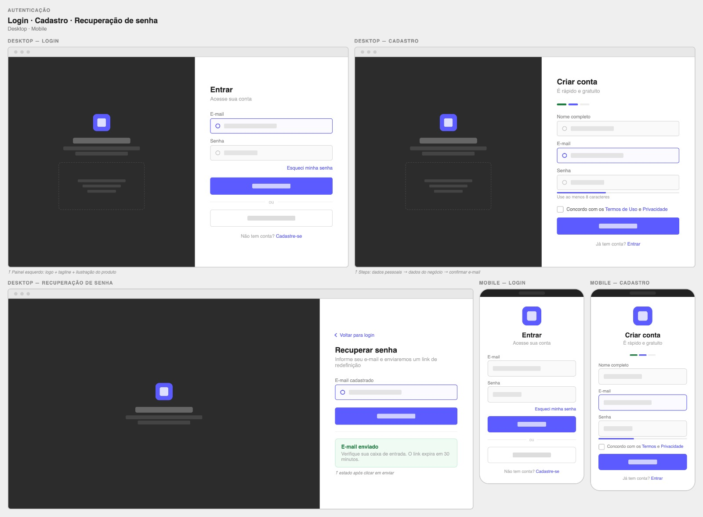
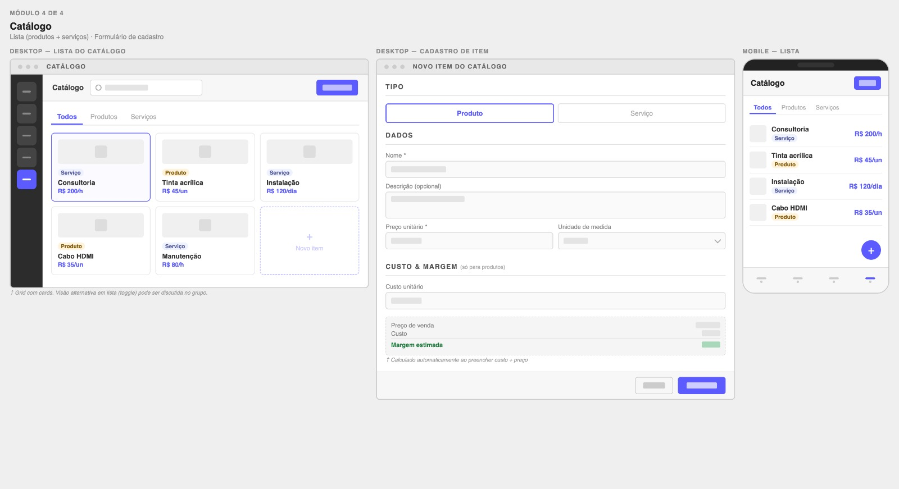
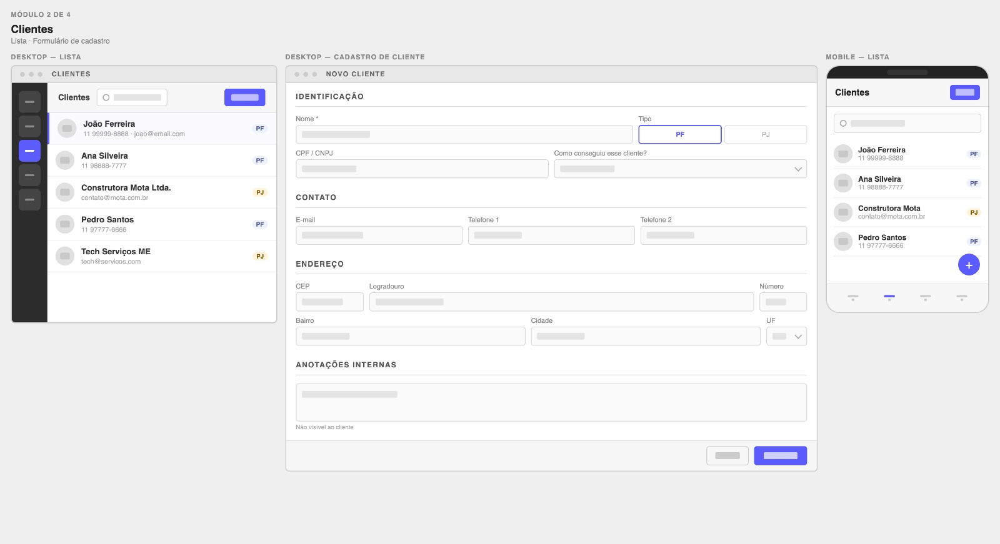
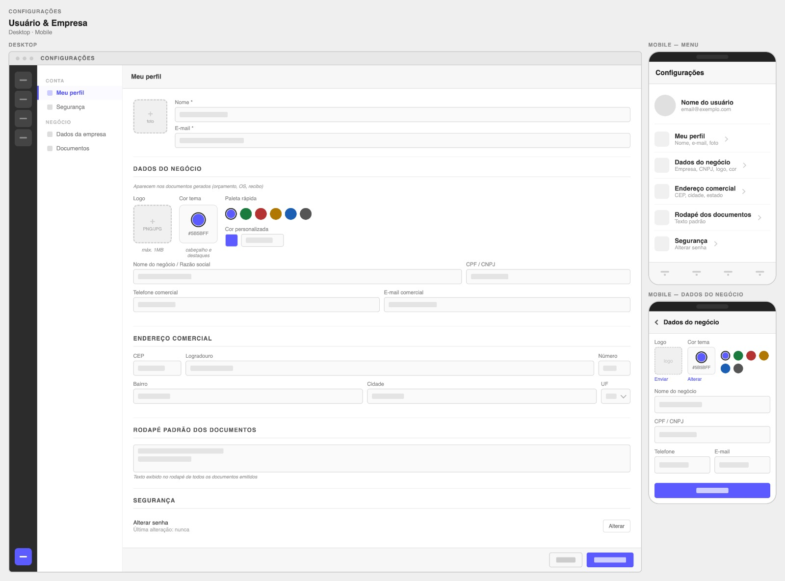

# Projeto de Interface

## Visão Geral

O projeto de interface foi desenvolvido com o objetivo de proporcionar uma experiência simples, intuitiva e eficiente para profissionais autônomos e pequenos prestadores de serviço, conforme identificado nas personas e histórias de usuário.

As interfaces foram projetadas considerando:

- Facilidade de uso (RNF-003)  
- Rapidez na execução de tarefas  
- Clareza na visualização das informações  
- Compatibilidade entre desktop e dispositivos móveis (RNF-004)  

A navegação do sistema foi organizada em módulos principais (Clientes, Catálogo, Pedidos e Financeiro), permitindo que o usuário acesse rapidamente as funcionalidades essenciais do sistema.

## Diagrama de Fluxo

O fluxo de interação do usuário foi estruturado de forma simples e linear, reduzindo a complexidade e facilitando o uso diário.

### Fluxo principal do sistema

    Login / Cadastro
            ↓
    Dashboard / Financeiro
            ↓
    ├── Clientes
    │     ├── Listar clientes
    │     └── Cadastrar / Editar cliente
    │
    ├── Catálogo
    │     ├── Listar produtos/serviços
    │     └── Cadastrar item
    │
    ├── Pedidos
    │     ├── Criar pedido
    │     ├── Editar pedido
    │     └── Gerar documentos (recibo/orçamento/OS)
    │
    └── Financeiro
          ├── Visualizar painel
          └── Criar lançamento

Esse fluxo permite que o usuário realize suas tarefas principais com poucos passos, atendendo especialmente:

- João (rapidez)
- Carla (organização)
- Marcos (visão compartilhada)

## Wireframes

### 1. Autenticação (Login, Cadastro e Recuperação de Senha)

#### Objetivo
Permitir que o usuário acesse o sistema de forma segura e crie sua conta.

#### Funcionalidades
- Login com e-mail e senha  
- Cadastro de novo usuário  
- Recuperação de senha  

#### Requisitos atendidos
- RF-001  
- RF-002  
- RF-003  
- RNF-001  
- RNF-002  

#### Decisões de design
- Layout dividido com área visual e formulário  
- Campos simples e diretos  
- Botões de ação destacados  
- Versão mobile otimizada para uso rápido  

#### Relação com personas
- João: acesso rápido  
- Carla: experiência profissional  
- Marcos: facilidade para múltiplos acessos  

### 2. Catálogo (Produtos e Serviços)

#### Objetivo
Gerenciar os itens oferecidos pelo usuário.

#### Funcionalidades
- Listagem em cards  
- Filtro por tipo (produto/serviço)  
- Cadastro e edição de itens  
- Definição de preço e unidade  

#### Requisitos atendidos
- RF-012  
- RF-013  
- RF-014  
- RF-015  

#### Decisões de design
- Uso de cards para melhor visualização  
- Separação por abas (Todos, Produtos, Serviços)  
- Destaque para preço  

#### Diferencial
- Campo de custo e margem para produtos  

#### Relação com personas
- João: visão rápida  
- Carla: padronização  
- Marcos: controle facilitado  

---

### 3. Financeiro

#### Objetivo
Apresentar a situação financeira do negócio de forma clara e centralizada.

#### Funcionalidades
- Painel com indicadores:
  - Receita confirmada  
  - Valores a receber  
  - Valores em atraso  
  - Resultado  
- Lista de lançamentos  
- Cadastro de receitas e custos  

#### Requisitos atendidos
- RF-016  
- RF-017  
- RF-018  

#### Decisões de design
- Uso de cores para status:
  - Verde → confirmado  
  - Azul → pendente  
  - Vermelho → atraso  
- Gráfico simplificado para análise rápida  
- Lista com informações resumidas  

#### Relação com personas
- João: controle básico  
- Carla: visão estratégica  
- Marcos: acompanhamento financeiro  

### 4. Lista de Clientes

#### Objetivo
Permitir a visualização, organização e gerenciamento dos clientes cadastrados no sistema.

#### Descrição da Interface
A tela apresenta uma listagem clara e organizada dos clientes, permitindo acesso rápido às informações principais. Cada cliente é exibido com dados resumidos, facilitando a identificação e seleção.

Além da listagem, a interface permite o acesso ao cadastro completo do cliente, estruturado em seções bem definidas para melhor organização das informações.

#### Funcionalidades
- Visualização da lista de clientes cadastrados  
- Busca de clientes por nome  
- Identificação do tipo de cliente (Pessoa Física ou Jurídica)  
- Acesso ao cadastro completo do cliente  
- Criação, edição e exclusão de clientes  

#### Estrutura do Cadastro de Cliente
O formulário de cadastro foi organizado em blocos para facilitar o preenchimento e leitura:

- **Identificação:** nome, CPF ou CNPJ  
- **Contato:** telefone e e-mail  
- **Endereço:** rua, número, bairro, cidade, estado e CEP  
- **Anotações:** campo livre para observações internas  

#### Decisões de Design
- Separação das informações por seções → melhora a usabilidade  
- Lista simples → facilita leitura rápida  
- Campos objetivos → reduz tempo de preenchimento  

#### Requisitos atendidos
- RF-004  
- RF-005  
- RF-006  
- RF-007  

---

### 5. Perfil do Usuário ("Meu Perfil")

#### Objetivo
Permitir que o usuário gerencie seus dados pessoais e as informações do seu negócio, utilizadas nos documentos e na personalização do sistema.

#### Descrição da Interface
A tela de perfil centraliza todas as informações do usuário e do seu negócio, permitindo edição completa dos dados. A organização em seções facilita a atualização e manutenção das informações.

#### Funcionalidades
- Visualização e edição dos dados pessoais  
- Atualização das informações do negócio  
- Upload e alteração do logotipo  
- Alteração de senha  
- Personalização de dados exibidos nos documentos  

#### Estrutura das Informações

O perfil foi dividido em blocos para melhor organização:

- **Dados do usuário:** nome e informações de acesso  
- **Dados do negócio:** nome do negócio e razão social  
- **Documento:** CPF ou CNPJ  
- **Contato:** telefone e e-mail comercial  
- **Logotipo:** imagem utilizada nos documentos  
- **Rodapé padrão:** texto exibido em propostas, recibos e ordens de serviço  
- **Anotações:** campo livre para informações adicionais  

#### Decisões de Design
- Centralização de todas as configurações em uma única tela  
- Organização por seções → facilita edição  
- Campos editáveis de forma direta → maior agilidade  
- Personalização visual (logotipo e rodapé) → reforça profissionalismo  

#### Requisitos atendidos
- RF-001  
- RF-002  
- RNF-003  

## Versão Mobile

A versão mobile foi projetada com foco em praticidade e uso rápido.

#### Características
- Layout vertical  
- Botão flutuante (+) para ações principais  
- Navegação simplificada  
- Elementos adaptados para toque  

#### Requisitos atendidos
- RNF-004  

---

## Justificativa de Design

O projeto foi baseado em três pilares principais:

### Simplicidade
- Interfaces limpas  
- Redução de elementos desnecessários  
- Navegação direta  

### Eficiência
- Ações principais sempre visíveis  
- Redução de cliques  
- Fluxo otimizado  

### Clareza
- Uso de cores para indicar status  
- Organização por módulos  
- Hierarquia visual bem definida  

---

## Conclusão

As interfaces desenvolvidas atendem às necessidades do público-alvo ao oferecer uma experiência simples, organizada e eficiente.

A aplicação permite que profissionais autônomos e pequenos empreendedores tenham maior controle sobre suas atividades comerciais e financeiras, contribuindo para uma gestão mais profissional e estruturada.

Além disso, a adaptação para dispositivos móveis garante acessibilidade e uso contínuo no dia a dia, reforçando a proposta de praticidade da solução.
