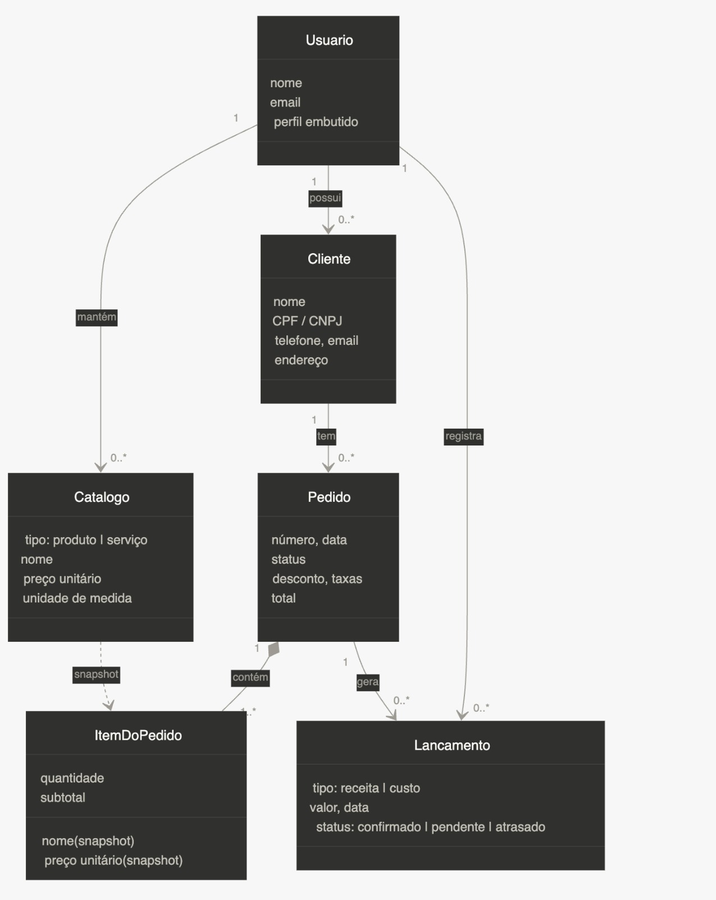

# Arquitetura da Solução

<span style="color:red">Pré-requisitos: <a href="3-Projeto de Interface.md"> Projeto de Interface</a></span>

Definição de como o software é estruturado em termos dos componentes que fazem parte da solução e do ambiente de hospedagem da aplicação.


## Diagrama de Classes



## Documentação do Banco de Dados MongoDB

Este documento descreve a estrutura e o esquema do banco de dados não relacional utilizado por nosso projeto, baseado em MongoDB. O MongoDB é um banco de dados NoSQL que armazena dados em documentos JSON (ou BSON, internamente), permitindo uma estrutura flexível e escalável para armazenar e consultar dados.

## Esquema do Banco de Dados
### Coleção: usuarios
 
Armazena os dados de autenticação e o perfil do negócio do usuário.
 
**Estrutura do Documento**
 
```json
{
    "_id": "ObjectId('6751a1b2c3d4e5f6a7b8c9d1')",
    "nome": "Carlos Mota",
    "email": "carlos@motaservicos.com.br",
    "passwordHash": "hash_da_senha",
    "perfil": {
        "nomeNegocio": "Mota Serviços ME",
        "documento": "12.345.678/0001-99",
        "telefone": "31 99999-1234",
        "emailComercial": "contato@motaservicos.com.br",
        "logoUrl": "https://storage.exemplo.com/logos/mota.png",
        "corTema": "#1A7A3E",
        "rodapePadrao": "Agradecemos a preferência. Dúvidas: contato@motaservicos.com.br",
        "endereco": {
            "cep": "30130-110",
            "logradouro": "Av. Afonso Pena",
            "numero": "1500",
            "complemento": "Sala 302",
            "bairro": "Centro",
            "cidade": "Belo Horizonte",
            "estado": "MG"
        }
    },
    "createdAt": "2026-01-10T09:00:00Z",
    "updatedAt": "2026-03-01T14:30:00Z"
}
```
 
#### Descrição dos Campos
> - <strong>_id:</strong> Identificador único do usuário gerado automaticamente pelo MongoDB.
> - <strong>nome:</strong> Nome completo do usuário.
> - <strong>email:</strong> Endereço de e-mail de acesso.
> - <strong>passwordHash:</strong> Hash da senha do usuário.
> - <strong>perfil:</strong> Objeto embutido com os dados do negócio do usuário.
> - <strong>perfil.nomeNegocio:</strong> Nome fantasia ou razão social do negócio.
> - <strong>perfil.documento:</strong> CPF ou CNPJ do prestador.
> - <strong>perfil.telefone:</strong> Telefone comercial.
> - <strong>perfil.emailComercial:</strong> E-mail exibido nos documentos gerados.
> - <strong>perfil.logoUrl:</strong> URL da logo utilizada nos documentos gerados.
> - <strong>perfil.corTema:</strong> Cor hexadecimal utilizada no cabeçalho e destaques dos documentos. Exemplo: `#5B5BFF`.
> - <strong>perfil.rodapePadrao:</strong> Texto exibido no rodapé de todos os documentos emitidos.
> - <strong>perfil.endereco:</strong> Objeto com o endereço comercial utilizado nos documentos.
> - <strong>perfil.endereco.cep:</strong> CEP do endereço comercial.
> - <strong>perfil.endereco.logradouro:</strong> Logradouro do endereço.
> - <strong>perfil.endereco.numero:</strong> Número do endereço.
> - <strong>perfil.endereco.complemento:</strong> Complemento do endereço.
> - <strong>perfil.endereco.bairro:</strong> Bairro.
> - <strong>perfil.endereco.cidade:</strong> Cidade.
> - <strong>perfil.endereco.estado:</strong> UF com 2 caracteres. Exemplo: `MG`.
> - <strong>createdAt:</strong> Data e hora de criação do documento.
> - <strong>updatedAt:</strong> Data e hora da última atualização dos dados do usuário.

### Coleção: clientes
 
Armazena os clientes cadastrados pelo usuário. O endereço é embutido diretamente no documento pois um cliente possui um único endereço no escopo do MVP.
 
**Estrutura do Documento**
 
```json
{
    "_id": "ObjectId('6751a1b2c3d4e5f6a7b8c9d2')",
    "usuarioId": "ObjectId('6751a1b2c3d4e5f6a7b8c9d1')",
    "nome": "João Ferreira",
    "tipoPessoa": "fisica",
    "documento": "123.456.789-00",
    "email": "joao@email.com",
    "telefone": "31 98888-5678",
    "origem": "indicacao",
    "aniversario": "1985-07-22",
    "anotacoes": "Cliente pontual. Prefere contato por WhatsApp.",
    "endereco": {
        "cep": "31270-080",
        "logradouro": "Rua das Flores",
        "numero": "42",
        "complemento": "Apto 5",
        "bairro": "Santa Efigênia",
        "cidade": "Belo Horizonte",
        "estado": "MG"
    },
    "createdAt": "2026-01-15T10:00:00Z",
    "updatedAt": "2026-02-20T09:00:00Z"
}
```
 
#### Descrição dos Campos
> - <strong>_id:</strong> Identificador único do cliente gerado automaticamente pelo MongoDB.
> - <strong>usuarioId:</strong> Referência ao `_id` do usuário dono do cadastro. Todos os dados pertencem a este usuário.
> - <strong>nome:</strong> Nome completo (pessoa física) ou razão social (pessoa jurídica).
> - <strong>tipoPessoa:</strong> Tipo do cliente. Valores possíveis: `fisica`, `juridica`. Default: `fisica`.
> - <strong>documento:</strong> CPF para pessoa física ou CNPJ para pessoa jurídica.
> - <strong>email:</strong> E-mail de contato do cliente.
> - <strong>telefone:</strong> Telefone principal com DDD.
> - <strong>origem:</strong> Campo livre indicando como o usuário conseguiu esse cliente.
> - <strong>aniversario:</strong> Data de aniversário no formato `YYYY-MM-DD`.
> - <strong>anotacoes:</strong> Notas internas sobre o cliente. Não visível ao cliente.
> - <strong>endereco:</strong> Objeto com o endereço do cliente.
> - <strong>endereco.cep:</strong> CEP.
> - <strong>endereco.logradouro:</strong> Logradouro.
> - <strong>endereco.numero:</strong> Número.
> - <strong>endereco.complemento:</strong> Complemento.
> - <strong>endereco.bairro:</strong> Bairro.
> - <strong>endereco.cidade:</strong> Cidade.
> - <strong>endereco.estado:</strong> UF com 2 caracteres.
> - <strong>createdAt:</strong> Data e hora de criação do documento.
> - <strong>updatedAt:</strong> Data e hora da última atualização dos dados do cliente.

### Coleção: catalogo
 
Armazena os produtos e serviços do usuário em uma coleção unificada. O campo `tipo` distingue os dois. O campo `custoUnitario` é relevante apenas para `tipo: "produto"` e é utilizado para cálculo de margem de lucro.
 
**Estrutura do Documento**
 
```json
{
    "_id": "ObjectId('6751a1b2c3d4e5f6a7b8c9d3')",
    "usuarioId": "ObjectId('6751a1b2c3d4e5f6a7b8c9d1')",
    "tipo": "servico",
    "nome": "Consultoria em TI",
    "descricao": "Análise e suporte técnico presencial ou remoto.",
    "precoUnitario": 200.00,
    "unidadeMedida": "h",
    "custoUnitario": null,
    "createdAt": "2026-01-12T08:00:00Z",
    "updatedAt": "2026-02-01T11:00:00Z"
}
```
 
#### Descrição dos Campos
> - <strong>_id:</strong> Identificador único do item gerado automaticamente pelo MongoDB.
> - <strong>usuarioId:</strong> Referência ao `_id` do usuário dono do item.
> - <strong>tipo:</strong> Tipo do item no catálogo. Valores possíveis: `produto`, `servico`.
> - <strong>nome:</strong> Nome do produto ou serviço.
> - <strong>descricao:</strong> Descrição detalhada do produto ou serviço. Campo opcional.
> - <strong>precoUnitario:</strong> Preço de venda por unidade de medida. Default: `0`.
> - <strong>unidadeMedida:</strong> Unidade de medida do item. Valores possíveis: `un`, `dz`, `h`, `dias`, `semanas`, `meses`, `m`, `m2`, `kg`, `cx`, `kit`, `pc`. Default: `un`.
> - <strong>custoUnitario:</strong> Custo por unidade para o prestador. Utilizado para calcular a margem de lucro. Relevante apenas para `tipo: "produto"`. Pode ser `null`.
> - <strong>createdAt:</strong> Data e hora de criação do documento.
> - <strong>updatedAt:</strong> Data e hora da última atualização dos dados do item.

### Coleção: pedidos
 
Coleção central do sistema. Armazena os pedidos realizados para os clientes do usuário. Os itens do pedido são embutidos no array `itens[]` pois sempre são lidos em conjunto com o pedido e não possuem existência independente. Cada item guarda um snapshot dos dados do catálogo no momento da inserção, garantindo que alterações futuras no catálogo não afetem pedidos já criados. O campo `total` é desnormalizado e calculado pela aplicação sempre que `itens`, `desconto` ou taxas forem alterados.
 
**Estrutura do Documento**
 
```json
{
    "_id": "ObjectId('6751a1b2c3d4e5f6a7b8c9d5')",
    "usuarioId": "ObjectId('6751a1b2c3d4e5f6a7b8c9d1')",
    "clienteId": "ObjectId('6751a1b2c3d4e5f6a7b8c9d2')",
    "numero": "PED-0004-2026",
    "referencia": "Reforma elétrica - bloco B",
    "status": "em_andamento",
    "meiosPagamento": ["pix", "transferencia_bancaria"],
    "itens": [
        {
            "_id": "ObjectId('6751a1b2c3d4e5f6a7b8c9e1')",
            "catalogoId": "ObjectId('6751a1b2c3d4e5f6a7b8c9d3')",
            "tipo": "servico",
            "nome": "Consultoria em TI",
            "descricao": "Análise e suporte técnico presencial ou remoto.",
            "precoUnitario": 200.00,
            "unidadeMedida": "h",
            "quantidade": 4,
            "subtotal": 800.00,
            "ordem": 0
        },
        {
            "_id": "ObjectId('6751a1b2c3d4e5f6a7b8c9e2')",
            "catalogoId": "ObjectId('6751a1b2c3d4e5f6a7b8c9d4')",
            "tipo": "produto",
            "nome": "Cabo HDMI 2m",
            "descricao": "Cabo HDMI de alta velocidade, 2 metros.",
            "precoUnitario": 45.00,
            "unidadeMedida": "un",
            "quantidade": 2,
            "subtotal": 90.00,
            "ordem": 1
        }
    ],
    "desconto": 50.00,
    "taxas": 0.00,
    "total": 840.00,
    "condicoesPagamento": "50% na aprovação, 50% na entrega",
    "garantia": "90 dias para defeitos de instalação",
    "informacoesAdicionais": "Serviço realizado em horário comercial.",
    "anotacoes": "Cliente solicitou nota fiscal.",
    "createdAt": "2026-03-14T09:00:00Z",
    "updatedAt": "2026-03-14T15:30:00Z"
}
```
 
#### Descrição dos Campos
> - <strong>_id:</strong> Identificador único do pedido gerado automaticamente pelo MongoDB.
> - <strong>usuarioId:</strong> Referência ao `_id` do usuário dono do pedido.
> - <strong>clienteId:</strong> Referência ao `_id` do cliente vinculado ao pedido. Pode ser `null`.
> - <strong>numero:</strong> Número sequencial do pedido no formato `PED-{DATA:HORA(ISO 8601)}`.
> - <strong>referencia:</strong> Campo livre de identificação interna do pedido.
> - <strong>status:</strong> Status atual do pedido. Valores possíveis: `rascunho`, `aguardando_aprovacao`, `em_andamento`, `concluido`, `garantia`, `cancelado`. Default: `rascunho`.
> - <strong>meiosPagamento:</strong> Array com os meios de pagamento aceitos no pedido. Valores possíveis: `pix`, `dinheiro`, `cartao_credito`, `cartao_debito`, `transferencia_bancaria`, `boleto`.
> - <strong>itens:</strong> Array com os itens incluídos no pedido. Embutido no documento com snapshot dos dados do catálogo.
> - <strong>itens[]._id:</strong> Identificador único do item dentro do pedido.
> - <strong>itens[].catalogoId:</strong> Referência soft ao item do catálogo original. Sem FK rígida: O item do pedido sobrevive caso o catálogo seja excluído.
> - <strong>itens[].tipo:</strong> Snapshot do tipo do item no momento da venda. Valores possíveis: `produto`, `servico`.
> - <strong>itens[].nome:</strong> Snapshot do nome do item no momento da venda.
> - <strong>itens[].descricao:</strong> Snapshot da descrição do item no momento da venda.
> - <strong>itens[].precoUnitario:</strong> Snapshot do preço unitário no momento da venda.
> - <strong>itens[].unidadeMedida:</strong> Snapshot da unidade de medida no momento da venda.
> - <strong>itens[].quantidade:</strong> Quantidade do item no pedido. Default: `1`.
> - <strong>itens[].subtotal:</strong> Resultado de `precoUnitario × quantidade`.
> - <strong>itens[].ordem:</strong> Posição do item na exibição do pedido. Default: `0`.
> - <strong>desconto:</strong> Valor absoluto do desconto aplicado ao pedido. Default: `0`.
> - <strong>taxas:</strong> Taxas aplicadas. Default: `0`.
> - <strong>total:</strong> Total do pedido desnormalizado, calculado pela aplicação como `SUM(itens[].subtotal) - desconto + taxas`.
> - <strong>condicoesPagamento:</strong> Condições de pagamento acordadas (texto livre).
> - <strong>garantia:</strong> Prazo e condições de garantia (texto livre).
> - <strong>informacoesAdicionais:</strong> Informações visíveis ao cliente.
> - <strong>anotacoes:</strong> Notas internas. Não visível ao cliente.
> - <strong>createdAt:</strong> Data e hora de criação do documento.
> - <strong>updatedAt:</strong> Data e hora da última atualização dos dados do pedido.

### Coleção: lancamentos
 
Armazena todas as movimentações financeiras do usuário, receitas e custos, em uma única coleção. O campo `tipo` distingue os dois. Lançamentos podem estar vinculados a um pedido ou ser avulsos para custos gerais do negócio, como aluguel, material e outros.
 
**Estrutura do Documento**
 
```json
{
    "_id": "ObjectId('6751a1b2c3d4e5f6a7b8c9d6')",
    "usuarioId": "ObjectId('6751a1b2c3d4e5f6a7b8c9d1')",
    "tipo": "receita",
    "status": "confirmado",
    "valor": 400.00,
    "dataLancamento": "2026-03-14T00:00:00Z",
    "dataVencimento": null,
    "pedidoId": "ObjectId('6751a1b2c3d4e5f6a7b8c9d5')",
    "clienteId": "ObjectId('6751a1b2c3d4e5f6a7b8c9d2')",
    "categoria": null,
    "meioPagamento": "pix",
    "referencia": "parcela 1/2",
    "anotacoes": null,
    "createdAt": "2026-03-14T16:00:00Z",
    "updatedAt": "2026-03-14T16:00:00Z"
}
```
 
```json
{
    "_id": "ObjectId('6751a1b2c3d4e5f6a7b8c9d7')",
    "usuarioId": "ObjectId('6751a1b2c3d4e5f6a7b8c9d1')",
    "tipo": "custo",
    "status": "confirmado",
    "valor": 350.00,
    "dataLancamento": "2026-03-01T00:00:00Z",
    "dataVencimento": "2026-03-01T00:00:00Z",
    "pedidoId": null,
    "clienteId": null,
    "categoria": "aluguel",
    "meioPagamento": "transferencia_bancaria",
    "referencia": "Aluguel do escritório — março/2026",
    "anotacoes": null,
    "createdAt": "2026-03-01T10:00:00Z",
    "updatedAt": "2026-03-01T10:00:00Z"
}
```
 
#### Descrição dos Campos
> - <strong>_id:</strong> Identificador único do lançamento gerado automaticamente pelo MongoDB.
> - <strong>usuarioId:</strong> Referência ao `_id` do usuário dono do lançamento.
> - <strong>tipo:</strong> Tipo da movimentação financeira. Valores possíveis: `receita`, `custo`.
> - <strong>status:</strong> Status do lançamento. Para receitas: `confirmado` (recebido), `pendente` (a receber), `atrasado` (em atraso). Para custos: `confirmado` (pago), `pendente` (previsto), `atrasado` (em atraso).
> - <strong>valor:</strong> Valor monetário da movimentação.
> - <strong>dataLancamento:</strong> Data da movimentação. Default: data atual.
> - <strong>dataVencimento:</strong> Data de vencimento. Relevante para lançamentos com status `pendente` e `atrasado`. Pode ser `null`.
> - <strong>pedidoId:</strong> Referência ao `_id` do pedido vinculado. `null` para lançamentos avulsos não relacionados a um pedido.
> - <strong>categoria:</strong> Categoria do lançamento (texto livre). Exemplo: `aluguel`, `material`, `outros`.
> - <strong>meioPagamento:</strong> Meio de pagamento utilizado. Valores possíveis: `pix`, `dinheiro`, `cartao_credito`, `cartao_debito`, `transferencia_bancaria`, `boleto`, `fiado`.
> - <strong>referencia:</strong> Descrição da movimentação. Exemplo: `"parcela 1/2"`, `"sinal 50%"`.
> - <strong>anotacoes:</strong> Notas internas do lançamento.
> - <strong>createdAt:</strong> Data e hora de criação do documento.
> - <strong>updatedAt:</strong> Data e hora da última atualização dos dados do lançamento.

### Boas Práticas

Validação de Dados: Implementar validação de esquema e restrições na aplicação para garantir a consistência dos dados.

Monitoramento e Logs: Utilize ferramentas de monitoramento e logging para acompanhar a saúde do banco de dados e diagnosticar problemas.

Escalabilidade: Considere estratégias de sharding e replicação para lidar com crescimento do banco de dados e alta disponibilidade.

### Material de Apoio da Etapa

Na etapa 2, em máterial de apoio, estão disponíveis vídeos com a configuração do mongo.db e a utilização com Bson no C#

## Tecnologias Utilizadas

Descreva aqui qual(is) tecnologias você vai usar para resolver o seu problema, ou seja, implementar a sua solução. Liste todas as tecnologias envolvidas, linguagens a serem utilizadas, serviços web, frameworks, bibliotecas, IDEs de desenvolvimento, e ferramentas.

Apresente também uma figura explicando como as tecnologias estão relacionadas ou como uma interação do usuário com o sistema vai ser conduzida, por onde ela passa até retornar uma resposta ao usuário.

## Hospedagem

Explique como a hospedagem e o lançamento da plataforma foi feita.

> **Links Úteis**:
>
> - [Website com GitHub Pages](https://pages.github.com/)
> - [Programação colaborativa com Repl.it](https://repl.it/)
> - [Getting Started with Heroku](https://devcenter.heroku.com/start)
> - [Publicando Seu Site No Heroku](http://pythonclub.com.br/publicando-seu-hello-world-no-heroku.html)

## Qualidade de Software

Conceituar qualidade de fato é uma tarefa complexa, mas ela pode ser vista como um método gerencial que através de procedimentos disseminados por toda a organização, busca garantir um produto final que satisfaça às expectativas dos stakeholders.

No contexto de desenvolvimento de software, qualidade pode ser entendida como um conjunto de características a serem satisfeitas, de modo que o produto de software atenda às necessidades de seus usuários. Entretanto, tal nível de satisfação nem sempre é alcançado de forma espontânea, devendo ser continuamente construído. Assim, a qualidade do produto depende fortemente do seu respectivo processo de desenvolvimento.

A norma internacional ISO/IEC 25010, que é uma atualização da ISO/IEC 9126, define oito características e 30 subcaracterísticas de qualidade para produtos de software.
Com base nessas características e nas respectivas sub-características, identifique as sub-características que sua equipe utilizará como base para nortear o desenvolvimento do projeto de software considerando-se alguns aspectos simples de qualidade. Justifique as subcaracterísticas escolhidas pelo time e elenque as métricas que permitirão a equipe avaliar os objetos de interesse.

> **Links Úteis**:
>
> - [ISO/IEC 25010:2011 - Systems and software engineering — Systems and software Quality Requirements and Evaluation (SQuaRE) — System and software quality models](https://www.iso.org/standard/35733.html/)
> - [Análise sobre a ISO 9126 – NBR 13596](https://www.tiespecialistas.com.br/analise-sobre-iso-9126-nbr-13596/)
> - [Qualidade de Software - Engenharia de Software 29](https://www.devmedia.com.br/qualidade-de-software-engenharia-de-software-29/18209/)
