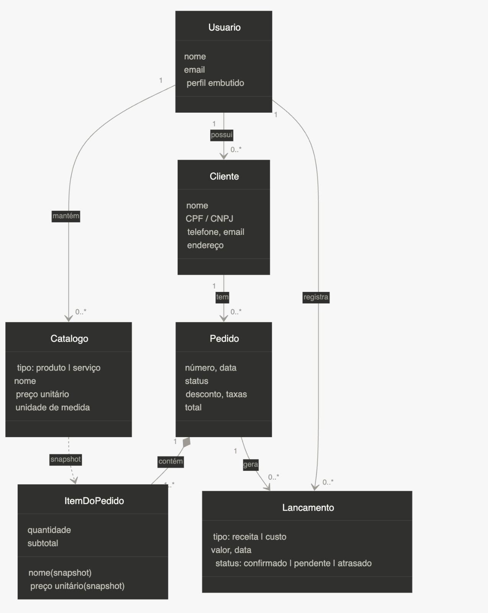

# Arquitetura da Solução

<span style="color:red">Pré-requisitos: <a href="04-Projeto de Interface.md"> Projeto de Interface</a></span>

Este documento descreve como o software está estruturado em termos de componentes, persistência e fluxo entre as aplicações do projeto.

> **Pendência registrada:** a figura de arquitetura vinculada a esta seção deve ser revisada para confirmar aderência ao estado atual da solução, que hoje é composta por API Fastify, frontend web em Next.js, aplicação mobile em Expo e geração de documentos PDF no backend.


## Diagrama de Classes

> **Pendência registrada:** o diagrama de classes deve ser atualizado para refletir os nomes e relacionamentos reais do domínio atual (`profile`, `clientes`, `catalog`, `orders`, `transactions`).



## Documentação do Banco de Dados MongoDB

O projeto utiliza MongoDB como base principal de persistência. A autenticação é tratada por Better Auth, que mantém coleções próprias de sessão e usuário. Já o domínio de negócio do projeto é organizado nas coleções descritas abaixo.

## Esquema do Banco de Dados

### Coleção: profile

Armazena os dados do negócio vinculados ao usuário autenticado. A identificação do dono do perfil ocorre por `authUserId`, e o documento é criado de forma automática quando necessário.

**Estrutura do Documento**

```json
{
  "_id": "ObjectId('6851a1b2c3d4e5f6a7b8c9d1')",
  "authUserId": "user_123",
  "business": {
    "name": "Mota Serviços",
    "document": "12.345.678/0001-99",
    "phone": "31 99999-1234",
    "email": "contato@motaservicos.com.br",
    "logo": null,
    "color": "#4F46E5",
    "footer": "Atendimento em horário comercial.",
    "address": {
      "zipCode": "30130-110",
      "street": "Av. Afonso Pena",
      "number": "1500",
      "complement": "Sala 302",
      "district": "Centro",
      "city": "Belo Horizonte",
      "state": "MG",
      "country": "Brasil"
    }
  },
  "createdAt": "2026-06-01T09:00:00.000Z",
  "updatedAt": "2026-06-21T14:30:00.000Z"
}
```

#### Descrição dos Campos

> - <strong>\_id:</strong> Identificador único do perfil.
> - <strong>authUserId:</strong> Identificador do usuário autenticado no Better Auth.
> - <strong>business:</strong> Objeto com os dados públicos e operacionais do negócio.
> - <strong>business.name:</strong> Nome do negócio.
> - <strong>business.document:</strong> CPF ou CNPJ do responsável.
> - <strong>business.phone:</strong> Telefone principal do negócio.
> - <strong>business.email:</strong> E-mail exibido em documentos.
> - <strong>business.logo:</strong> Referência textual para logo, quando disponível.
> - <strong>business.color:</strong> Cor de apoio da identidade visual.
> - <strong>business.footer:</strong> Texto de rodapé utilizado nos documentos.
> - <strong>business.address:</strong> Endereço do negócio.
> - <strong>createdAt:</strong> Data de criação do perfil.
> - <strong>updatedAt:</strong> Data da última atualização.

### Coleção: clientes

Armazena os clientes cadastrados no escopo de cada perfil de negócio.

**Estrutura do Documento**

```json
{
  "_id": "ObjectId('6851a1b2c3d4e5f6a7b8c9d2')",
  "profileId": "6851a1b2c3d4e5f6a7b8c9d1",
  "name": "João Ferreira",
  "type": "individual",
  "document": "123.456.789-00",
  "email": "joao@email.com",
  "phone": "31 98888-5678",
  "origin": "indicação",
  "birthDate": "1985-07-22",
  "notes": "Cliente pontual. Prefere contato por WhatsApp.",
  "address": {
    "zipCode": "31270-080",
    "street": "Rua das Flores",
    "number": "42",
    "complement": "Apto 5",
    "district": "Santa Efigênia",
    "city": "Belo Horizonte",
    "state": "MG",
    "country": "Brasil"
  },
  "createdAt": "2026-06-05T10:00:00.000Z",
  "updatedAt": "2026-06-21T11:00:00.000Z"
}
```

#### Descrição dos Campos

> - <strong>profileId:</strong> Identificador do perfil dono do cadastro.
> - <strong>name:</strong> Nome do cliente.
> - <strong>type:</strong> Tipo do cliente. Valores possíveis: `individual`, `company`.
> - <strong>document:</strong> Documento do cliente.
> - <strong>email:</strong> E-mail de contato.
> - <strong>phone:</strong> Telefone principal do cliente.
> - <strong>origin:</strong> Origem do relacionamento comercial, quando registrada.
> - <strong>birthDate:</strong> Data de nascimento, quando aplicável.
> - <strong>notes:</strong> Observações internas.
> - <strong>address:</strong> Endereço do cliente.
> - <strong>createdAt:</strong> Data de criação.
> - <strong>updatedAt:</strong> Data da última atualização.

### Coleção: catalog

Armazena produtos e serviços em uma coleção unificada, vinculada ao perfil do negócio.

**Estrutura do Documento**

```json
{
  "_id": "ObjectId('6851a1b2c3d4e5f6a7b8c9d3')",
  "profileId": "6851a1b2c3d4e5f6a7b8c9d1",
  "type": "service",
  "name": "Consultoria em TI",
  "description": "Análise e suporte técnico presencial ou remoto.",
  "unitPrice": 200,
  "unitMeasure": "hour",
  "costPrice": null,
  "createdAt": "2026-06-06T08:00:00.000Z",
  "updatedAt": "2026-06-21T11:30:00.000Z"
}
```

#### Descrição dos Campos

> - <strong>profileId:</strong> Identificador do perfil dono do item.
> - <strong>type:</strong> Tipo do item. Valores possíveis: `product`, `service`.
> - <strong>name:</strong> Nome do item.
> - <strong>description:</strong> Descrição opcional.
> - <strong>unitPrice:</strong> Preço unitário.
> - <strong>unitMeasure:</strong> Unidade de medida. Valores possíveis: `unit`, `dozen`, `hour`, `day`, `week`, `month`, `meter`, `squareMeter`, `kilogram`, `box`, `kit`, `piece`.
> - <strong>costPrice:</strong> Custo opcional utilizado no caso de produtos.
> - <strong>createdAt:</strong> Data de criação.
> - <strong>updatedAt:</strong> Data da última atualização.

### Coleção: orders

Armazena os pedidos do sistema. Cada pedido possui itens embutidos com snapshot dos dados do catálogo no momento da criação ou edição.

**Estrutura do Documento**

```json
{
  "_id": "ObjectId('6851a1b2c3d4e5f6a7b8c9d4')",
  "profileId": "6851a1b2c3d4e5f6a7b8c9d1",
  "clientId": "6851a1b2c3d4e5f6a7b8c9d2",
  "orderNumber": "ORD260601001",
  "reference": "Instalação elétrica - bloco B",
  "status": "inProgress",
  "paymentMethods": ["pix", "bankTransfer"],
  "items": [
    {
      "catalogItemId": "6851a1b2c3d4e5f6a7b8c9d3",
      "type": "service",
      "name": "Consultoria em TI",
      "description": "Análise e suporte técnico presencial ou remoto.",
      "unitPrice": 200,
      "unitMeasure": "hour",
      "quantity": 4,
      "subtotal": 800,
      "position": 0
    }
  ],
  "discount": 50,
  "fees": 0,
  "total": 750,
  "paymentTerms": "50% na aprovação e 50% na entrega",
  "warrantyTerms": "90 dias de garantia",
  "additionalInfo": "Execução em horário comercial.",
  "internalNotes": "Cliente solicitou nota fiscal.",
  "createdAt": "2026-06-10T09:00:00.000Z",
  "updatedAt": "2026-06-21T12:00:00.000Z"
}
```

#### Descrição dos Campos

> - <strong>profileId:</strong> Identificador do perfil dono do pedido.
> - <strong>clientId:</strong> Identificador do cliente vinculado. Pode ser `null`.
> - <strong>orderNumber:</strong> Número sequencial do pedido.
> - <strong>reference:</strong> Referência interna do pedido.
> - <strong>status:</strong> Status do pedido. Valores possíveis: `draft`, `pendingApproval`, `inProgress`, `completed`, `warranty`, `cancelled`.
> - <strong>paymentMethods:</strong> Métodos de pagamento aceitos. Valores possíveis: `pix`, `cash`, `creditCard`, `debitCard`, `bankTransfer`, `bankSlip`.
> - <strong>items:</strong> Itens do pedido com snapshot do catálogo.
> - <strong>items[].catalogItemId:</strong> Referência ao item de catálogo usado na composição.
> - <strong>items[].position:</strong> Ordem de exibição do item no pedido.
> - <strong>discount:</strong> Desconto aplicado ao pedido.
> - <strong>fees:</strong> Taxas adicionais.
> - <strong>total:</strong> Valor total do pedido.
> - <strong>paymentTerms:</strong> Condições de pagamento.
> - <strong>warrantyTerms:</strong> Texto livre de garantia.
> - <strong>additionalInfo:</strong> Informações adicionais visíveis no documento.
> - <strong>internalNotes:</strong> Observações internas.
> - <strong>createdAt:</strong> Data de criação.
> - <strong>updatedAt:</strong> Data da última atualização.

### Coleção: transactions

Armazena os lançamentos financeiros do sistema, tanto de receita quanto de custo.

**Estrutura do Documento**

```json
{
  "_id": "ObjectId('6851a1b2c3d4e5f6a7b8c9d5')",
  "profileId": "6851a1b2c3d4e5f6a7b8c9d1",
  "orderId": "6851a1b2c3d4e5f6a7b8c9d4",
  "clientId": "6851a1b2c3d4e5f6a7b8c9d2",
  "type": "income",
  "status": "confirmed",
  "paymentMethod": "pix",
  "amount": 400,
  "transactionDate": "2026-06-12T00:00:00.000Z",
  "dueDate": null,
  "category": "servicos",
  "reference": "Parcela 1/2",
  "notes": "Recebimento inicial confirmado.",
  "createdAt": "2026-06-12T15:00:00.000Z",
  "updatedAt": "2026-06-12T15:00:00.000Z"
}
```

#### Descrição dos Campos

> - <strong>profileId:</strong> Identificador do perfil dono do lançamento.
> - <strong>orderId:</strong> Identificador opcional do pedido vinculado.
> - <strong>clientId:</strong> Identificador opcional do cliente vinculado.
> - <strong>type:</strong> Tipo do lançamento. Valores possíveis: `income`, `expense`.
> - <strong>status:</strong> Status do lançamento. Valores possíveis: `pending`, `confirmed`, `cancelled`.
> - <strong>paymentMethod:</strong> Meio de pagamento opcional.
> - <strong>amount:</strong> Valor do lançamento.
> - <strong>transactionDate:</strong> Data principal da movimentação.
> - <strong>dueDate:</strong> Data de vencimento opcional.
> - <strong>category:</strong> Categoria opcional do lançamento.
> - <strong>reference:</strong> Texto de referência do lançamento.
> - <strong>notes:</strong> Observações internas.
> - <strong>createdAt:</strong> Data de criação.
> - <strong>updatedAt:</strong> Data da última atualização.

### Documentos Comerciais

Os documentos comerciais do sistema não são persistidos como uma coleção própria. Eles são gerados sob demanda a partir dos dados de `profile`, `clientes`, `orders` e `transactions`.

Os documentos atualmente suportados são:

- orçamento;
- ordem de serviço;
- recibo.

As regras atuais de disponibilidade são:

- orçamento: permitido para pedidos que não estejam `cancelled`;
- ordem de serviço: permitido apenas para pedidos `inProgress`, `completed` ou `warranty`;
- recibo: permitido apenas para lançamentos `confirmed`.

### Tecnologias Utilizadas

As principais tecnologias utilizadas na solução são:

- Node.js;
- TypeScript;
- Fastify;
- MongoDB;
- Better Auth;
- `@react-pdf/renderer`;
- Next.js;
- React;
- Expo;
- React Native;
- React Navigation;
- `pnpm`;
- `turbo`.

### Hospedagem

A solução foi estruturada como um monorepo com três aplicações principais: API, web e mobile. A interface web foi organizada para execução e publicação em ambiente compatível com Next.js, enquanto a API permanece como serviço Fastify separado. A aplicação mobile utiliza Expo para desenvolvimento, build e validação das interfaces.

> **Pendência registrada:** caso a banca exija detalhamento do ambiente final de publicação, essa seção deve ser complementada com o destino efetivamente adotado para cada aplicação.

### Qualidade de Software

No contexto do projeto, a qualidade de software foi tratada com foco em:

- **adequação funcional**, garantindo que os módulos principais do negócio estivessem operacionais;
- **confiabilidade**, por meio de validações, regras de negócio e testes automatizados no backend;
- **usabilidade**, com interfaces objetivas para web e mobile;
- **manutenibilidade**, com separação por apps e módulos em monorepo;
- **compatibilidade**, assegurando comunicação consistente entre API, web e mobile.

Esses critérios orientaram a implementação dos módulos de autenticação, perfil, clientes, catálogo, pedidos, lançamentos e documentos.
